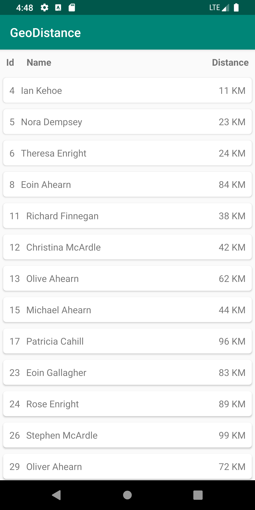
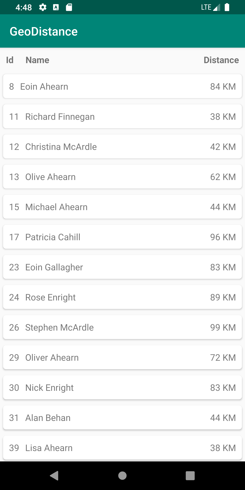

# geo-distance
Android app that calculates the shortest distance between 2 locations on map, based on Great Circle distance formula.

## Demo

  
  

## Tech Stack
- **MVVM**
- **Dagger**
- **Mockito**
- **Junit5**
- **RxJava**
